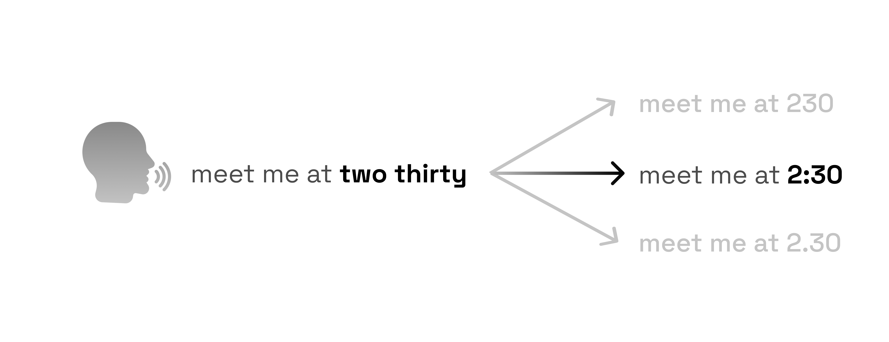

<p align="center">
  
</p>

<a href="https://pypi.org/project/premove-itn/" target="_blank" rel="noopener noreferrer"></a>
<a href="https://github.com/premove-ai/premove-itn/actions/workflows/ci.yml" target="_blank" rel="noopener noreferrer"></a>
<a href="https://github.com/premove-ai/premove-itn/blob/main/LICENSE" target="_blank" rel="noopener noreferrer"></a>
<a href="https://huggingface.co/premove-ai/premove-itn" target="_blank" rel="noopener noreferrer"></a>

Open-source, context-aware inverse text normalization for conversational
voice-agent transcripts, with open weights.

Premove ITN converts spoken ASR output into canonical written forms for phone
numbers, email addresses, identifiers, dates, times, money, measurements, and
alphanumeric codes.

<strong><a href="https://www.aryamantodkar.com/blog/how-i-built-an-open-source-itn-model-that-beat-nvidia-thutmose-on-voice-agent-transcripts/" target="_blank" rel="noopener noreferrer">Read how I ended up building Premove ITN →</a></strong>

## Demo

<p align="center">
  <a href="https://www.loom.com/share/aedcd3d5ac1f4906b105f36d16aa735b" target="_blank" rel="noopener noreferrer">
    
  </a>
</p>

## The ambiguity

| System | Output |
| --- | --- |
| Input | `the room code is one oh five` |
| Expected | `the room code is 105` |
| **Premove ITN** | `the room code is 105` ✓ |
| <a href="https://catalog.ngc.nvidia.com/orgs/nvidia/nemo/models/itn_en_thutmose_bert/-" target="_blank" rel="noopener noreferrer">NVIDIA Thutmose</a> | `the room code is 1 oh 5` ✗ |
| <a href="https://github.com/FluidInference/text-processing-rs" target="_blank" rel="noopener noreferrer"><code>text-processing-rs</code></a> | `the room code is 01:05` ✗ |

The spoken form is ambiguous. Context tells us that `one oh five` is an
identifier, not a time.

<p align="center">
  
</p>

These are the retained outputs for row `va6_collision_0013` in the
<a href="eval/voice_agent_itn/results/first-evaluation/REPORT.md" target="_blank" rel="noopener noreferrer">frozen evaluation</a>.

## Results

On our frozen benchmark, Premove ITN reaches **99.50% semantic accuracy on the
voice-agent subset**, compared with 68.25% for `text-processing-rs` and 67.00%
for NVIDIA Thutmose.

| Backend | Voice-agent semantic | Overall semantic | Mean warm latency |
| --- | ---: | ---: | ---: |
| **Premove ITN** | **99.50% (398/400)** | **89.70%** | 56.49 ms |
| <a href="https://catalog.ngc.nvidia.com/orgs/nvidia/nemo/models/itn_en_thutmose_bert/-" target="_blank" rel="noopener noreferrer">NVIDIA Thutmose</a> | 67.00% (268/400) | 59.39% | 15.98 ms |
| <a href="https://github.com/FluidInference/text-processing-rs" target="_blank" rel="noopener noreferrer"><code>text-processing-rs</code></a> | 68.25% (273/400) | 55.79% | **0.14 ms** |

The benchmark is a frozen, balanced synthetic stress suite with 1,500 rows and
includes a dedicated 400-row voice-agent subset. It was held out from both
training and checkpoint selection, so these scores come from unseen evaluation
data. Semantic accuracy checks whether the structured value is correct while
allowing approved formatting differences. Latency is warm, sequential batch-one
inference on an Apple M4 MacBook Air; every backend received transcript text
only. This is a synthetic stress benchmark, not a sample of live production
traffic.

<a href="eval/voice_agent_itn/results/first-evaluation/REPORT.md" target="_blank" rel="noopener noreferrer">Full report</a> ·
<a href="eval/voice_agent_itn/results/first-evaluation/DETAILS.md" target="_blank" rel="noopener noreferrer">Detailed results</a> ·
<a href="benchmarks/README.md" target="_blank" rel="noopener noreferrer">Reproduce the benchmark</a>

## Quick start

Install from PyPI:

```bash
pip install premove-itn
```

```python
from premove_itn import PremoveITN

itn = PremoveITN.from_pretrained()

print(itn.normalize("the room code is one oh five"))
# the room code is 105
```

`from_pretrained()` downloads the frozen model weights from
<a href="https://huggingface.co/premove-ai/premove-itn" target="_blank" rel="noopener noreferrer"><code>premove-ai/premove-itn</code></a> on
first use and caches them locally.

Create one `PremoveITN` instance and reuse it across requests. Model loading is
expensive; warm normalization calls are much faster.

For reproducible deployments, pin the package version:

```bash
pip install premove-itn==0.1.0
```

## Why this exists

I ran into this problem while building a voice agent. Deepgram gave me
transcripts in spoken form, but the tools behind the agent needed normalized
values. A person can read `one hundred twenty three` and know it means `123`; an
API usually cannot.

My first solution was <a href="https://github.com/FluidInference/text-processing-rs" target="_blank" rel="noopener noreferrer"><code>text-processing-rs</code></a>.
It was extremely fast and handled straightforward normalization well. But some
spoken forms are impossible to normalize correctly without the sentence around
them. `one oh five` might mean `105`, `1:05`, or something else entirely. Rules
can generate plausible answers, but they cannot always know which one the
speaker meant.

That sent me looking for context-aware ITN. I tried <a href="https://catalog.ngc.nvidia.com/orgs/nvidia/nemo/models/itn_en_thutmose_bert/-" target="_blank" rel="noopener noreferrer">NVIDIA Thutmose</a>,
but on the structured values I cared about for tool calls, I still found
surprisingly simple failures.

Premove ITN came from a different idea: do not ask the model to perform the
entire normalization. Generate the valid written forms first, then train the
model only to decide which one fits the context. An exact decoder handles the
rest.

## How Premove ITN works

Premove ITN splits normalization into three steps: **generate, score, decode**.

Simplified example:

```text
input
enter the digits four one seven two zero one two
                         │
                         ▼
1. GENERATE

Python enumerates spans; Rust generates valid written forms.

[four]                               → 4
[four one]                           → 41 | 04:01
[one seven two]                      → 172 | 17:02
...
[four one seven two zero one two]    → 4172012 | 417-2012
                         │
                         ▼
2. SCORE

DeBERTa encodes the transcript once.

Each candidate gets one score from:
contextual source span + candidate kind labels + proposed replacement
                         │
                         ▼
3. DECODE

Candidates can overlap, so Premove ITN uses exact dynamic programming
to find the highest-scoring compatible path through the transcript.
                         │
                         ▼
output
enter the digits 4172012
```

The rules decide **what can be written**. The model decides **what fits the
context**. The decoder decides **which edits can coexist**.

## Supported forms

Premove ITN covers English structured values commonly needed by voice agents:

| Form | Example |
| --- | --- |
| Numbers | `one hundred twenty` → `120` |
| Digit sequences | `zero eight two zero six three` → `082063` |
| Times | `four thirty` → `04:30` |
| Dates | `march fifth twenty twenty four` → `march 5 2024` |
| Money | `twenty dollars` → `$20` |
| Decimals | `one point five` → `1.5` |
| Measurements | `two hundred meters` → `200 m` |
| Ordinals | `the eighth` → `8th` |
| Phone numbers | `eight one four two three one four` → `814-2314` |
| Email and URLs | `support at example dot com` → `support@example.com` |
| Versions and identifiers | `v three dot one dot nine` → `v3.1.9` |
| Punctuation | `comma` → `,` |
| Abbreviations | `doctor` → `dr.` |

### Not supported

Premove ITN currently targets English structured text. It does not provide
first-class normalization for non-English speech, street addresses, free-form
rewriting, or arbitrary application-specific formats.

Source text is preserved wherever no candidate is selected.

See the <a href="docs/rust-candidate-coverage.md" target="_blank" rel="noopener noreferrer">full candidate coverage</a> for the exact
forms supported by each realizer.

## Limitations

- English only.
- Normalization is bounded by the deterministic candidates generated by the
  Rust realizers. The scorer cannot select a written form that was not generated.
- Inputs longer than 512 DeBERTa encoder tokens are rejected rather than
  silently truncated.
- A 435.6M-parameter DeBERTa-v3-large contextual scorer.
- About a 1.6 GB first model download.
- Multi-second model initialization.
- A custom candidate-scoring architecture; it is not a generic
  `AutoModel.from_pretrained()` model.
- A synthetic stress benchmark, not observed live-traffic accuracy.
- CUDA, Windows, macOS Intel, Linux ARM64, and other accelerators are not
  validated v0.1.0 support claims.

## Documentation

- <a href="docs/getting-started.md" target="_blank" rel="noopener noreferrer">Getting started</a>
- <a href="docs/architecture.md" target="_blank" rel="noopener noreferrer">Architecture</a>
- <a href="docs/rust-candidate-coverage.md" target="_blank" rel="noopener noreferrer">Candidate coverage</a>
- <a href="docs/model-card.md" target="_blank" rel="noopener noreferrer">Model card</a>
- <a href="docs/model-provenance.md" target="_blank" rel="noopener noreferrer">Model provenance</a>
- <a href="docs/inference-artifact.md" target="_blank" rel="noopener noreferrer">Inference artifact</a>
- <a href="docs/platform-support.md" target="_blank" rel="noopener noreferrer">Platform support</a>
- <a href="benchmarks/README.md" target="_blank" rel="noopener noreferrer">Benchmark reproduction</a>
- <a href="CONTRIBUTING.md" target="_blank" rel="noopener noreferrer">Contributing</a>

## Model, citation, and license

### Model and weights

The current public release is **v0.1.0**:

- <a href="https://pypi.org/project/premove-itn/" target="_blank" rel="noopener noreferrer">PyPI package</a>
- <a href="https://github.com/premove-ai/premove-itn/releases/tag/v0.1.0" target="_blank" rel="noopener noreferrer">GitHub release</a>
- <a href="https://huggingface.co/premove-ai/premove-itn/tree/v0.1.0" target="_blank" rel="noopener noreferrer">Hugging Face model</a>

The public inference artifact is
<a href="https://huggingface.co/premove-ai/premove-itn" target="_blank" rel="noopener noreferrer"><code>premove-ai/premove-itn</code></a>,
release `v0.1.0`, at the immutable commit
`80bda5e2e1fe9542aa628597090242df57c1a157`. `PremoveITN.from_pretrained()`
uses that commit by default and verifies the resolved revision, release
metadata, base model, and model-file digest before inference.

The artifact is inference-only. It excludes optimizer state, scheduler state,
training counters, training data, and evaluation rows. See the
<a href="docs/inference-artifact.md" target="_blank" rel="noopener noreferrer">artifact release record</a> and
<a href="docs/model-provenance.md" target="_blank" rel="noopener noreferrer">training provenance</a>.

The released scorer was trained on 418,000 examples across general text
normalization, conversational adaptation, and structured-value adaptation. The
frozen evaluation was excluded from training and checkpoint selection; see the
<a href="docs/model-provenance.md" target="_blank" rel="noopener noreferrer">training provenance</a>.

### Citation

The contextual scorer uses
<a href="https://huggingface.co/microsoft/deberta-v3-large" target="_blank" rel="noopener noreferrer"><code>microsoft/deberta-v3-large</code></a>
at a pinned revision as its encoder backbone. Premove ITN adds a custom candidate
scorer and exact decoder around the
<a href="https://arxiv.org/abs/2111.09543" target="_blank" rel="noopener noreferrer">DeBERTaV3 architecture</a>.

### License and attribution

Premove ITN source code and model weights are MIT licensed. The contextual
scorer uses <a href="https://huggingface.co/microsoft/deberta-v3-large" target="_blank" rel="noopener noreferrer"><code>microsoft/deberta-v3-large</code></a>
at a pinned revision as its encoder backbone. Candidate scoring and exact
decoding are Premove ITN-specific.

The Rust realization layer uses
<a href="https://github.com/FluidInference/text-processing-rs" target="_blank" rel="noopener noreferrer"><code>text-processing-rs</code></a>,
which is Apache-2.0 licensed. Required third-party licenses and notices are in
<a href="THIRD_PARTY_NOTICES.md" target="_blank" rel="noopener noreferrer"><code>THIRD_PARTY_NOTICES.md</code></a> and <a href="LICENSES/" target="_blank" rel="noopener noreferrer"><code>LICENSES/</code></a>.
